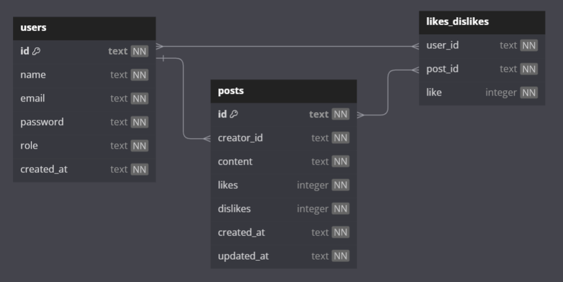

<h1 align="center">Projeto Labook</h1>

<div align="center">


Clique [**AQUI**](https://documenter.getpostman.com/view/28316385/2s9Ye8fuWG#intro) para conferir o resultado final da API!

<p align="center">
<br>
  <a href="https://skillicons.dev">
    
  </a>
</p>
<p align="center"><strong>Status do Projeto:<br></strong>Concluído ✔</p>

</div>

## Índice

-   [1. Resumo do Projeto](#resumo-do-projeto)
-   [2. Tecnologias e Conteúdos Utilizados](#tecnologias-e-conteúdos-utilizados)
-   [3. Banco de Dados](#banco-de-dados)
-   [4. Instalação](#instalação)
-   [5. Inicialização](#inicialização)
-   [6. Endpoints](#endpoints)
    -   [Get Users](#get-users)
    -   [Signup](#signup)
    -   [Login](#login)
    -   [Create Post](#create-post)
    -   [Get Posts](#get-posts)
    -   [Edit Post](#edit-post)
    -   [Delete Post](#delete-post)
    -   [Like/Dislike Post](#like-or-dislike-post)
-   [7. Tratamento de Erros](#tratamento-de-erros)
-   [8. Lista de Requisitos do Projeto](#lista-de-requisitos-do-projeto)
-   [9. Desenvolvedora](#desenvolvedora)

## Resumo do Projeto

[🔼](#projeto-labook)

O Labook é uma API de rede social que permite a interação entre os usuários. Ao se cadastrar e fazer login na plataforma, os usuários podem criar, dar like ou dislike em postagens de outros usuários.

A plataforma oferece uma variedade de recursos e funcionalidades que incluem:

-   **Cadastro de Usuários**: Através do processo de cadastro, os usuários podem criar suas contas na plataforma, fornecendo informações pessoais básicas como **nome**, **email** e **senha**.

-   **Criação de Postagens**: Os membros do Labook têm a capacidade de compartilhar suas ideias, pensamentos e experiências por meio de postagens.

-   **Likes e Dislikes**: Os usuários podem "curtir" ou "descurtir" postagens de outros membros, permitindo uma variedade de interações e opiniões sobre o conteúdo compartilhado.

-   **Gerenciamento de Postagens**: Os criadores de postagens têm controle total sobre seu conteúdo, podendo editá-lo ou excluí-lo conforme necessário.

-   **Recursos de Segurança**: Para garantir a segurança e privacidade dos usuários, o Labook implementa medidas de segurança, como senhas criptografadas e autenticação por meio de tokens JWT.

## Tecnologias e conteúdos utilizados

[🔼](#projeto-labook)

-   NodeJS
-   Typescript
-   Express
-   SQL e SQLite
-   Knex
-   POO
-   Arquitetura em camadas
-   Geração de UUID
-   Geração de hashes
-   Autenticação e Autorização
-   Roteamento
-   Postman

## Banco de dados

[🔼](#projeto-labook)

As entidades do banco de dados estão estruturadas da seguinte forma:



Clique [aqui](https://dbdiagram.io/d/63d16443296d97641d7c1ae1) para conferir o site com a estrutura do banco de dados.

## Instalação

[🔼](#projeto-labook)

Ter instalado o `node.js`, o `npm` e rodar o seguinte comando:

```bash
npm install
```

## Inicialização

[🔼](#projeto-labook)

Para rodar o servidor localmente digite o seguinte comando:

```bash
npm run dev
```

## Endpoints

[🔼](#projeto-labook)

Clique [**AQUI**](https://documenter.getpostman.com/view/28316385/2s9Ye8fuWG) para visualizar a documentação da [API LABOOK](https://documenter.getpostman.com/view/28316385/2s9Ye8fuWG).

A base URL para esta API é **`http://localhost:3003`**

Os endpoints estão divididos em pastas de acordo com o que é gerenciado.
A API fornece os seguintes endpoints:

### Get users

[🔼](#projeto-labook)

-   Endpoint privado (Somente **administradores** podem acessar esse recurso)
-   Método HTTP: GET
-   Descrição: Retorna todos os usuários cadastrados no sistema.
-   Enviar via headers.authorization: `token_de_autenticação`

**INPUT:**

```json
// headers.authorization = "token_de_autenticação"
```

**OUTPUT:**

```json
[
    {
        "id": "7ed8d1f6-4b22-4a0e-a38b-45f275c32d21",
        "name": "Morgana",
        "email": "morgana@gmail.com",
        "password": "$2a$12$IOmC1TDDM6YNMTTkRWqRxOeZ06jz/OnMsjLEHZdX5OrFD3sJIVBXy",
        "role": "NORMAL",
        "createdAt": "04-12-2023 11:31:26"
    },
    {
        "id": "16f86eba-fde0-42f5-a251-b0afe72b5c93",
        "name": "Amanda",
        "email": "amanda@gmail.com",
        "password": "$2a$12$7VRnTvXK8X5wsj84O207POIWCWhs/Ps8pw5wJH49OyuwqedAijnKe",
        "role": "ADMIN",
        "createdAt": "19-11-2023 12:27:51"
    },
    {
        "id": "527348d8-434d-4243-b5c9-927d8e96b418",
        "name": "Atlas",
        "email": "atlas@gmail.com",
        "password": "$2a$12$KOKtDri0bntdxt5488R1nOZabISu9jF4vBCOWIMlt6vcrUnp3hhm.",
        "role": "NORMAL",
        "createdAt": "19-11-2023 13:10:34"
    },
    {
        "id": "8b4d95ab-0b13-4092-8661-0b29bfa46830",
        "name": "Luan",
        "email": "luan@gmail.com",
        "password": "$2a$12$DMX1r916xqOPGrFgeVj0JeZXQYSOCmT5lzAmXc5tb2i3ddAO7geLi",
        "role": "ADMIN",
        "createdAt": "17-11-2023 14:26:54"
    }
]
```

### Signup

[🔼](#projeto-labook)

-   Endpoint público
-   Método HTTP: POST
-   Descrição: Cria um novo usuário.
-   Enviar via body: `name`, `email` e `password`

**INPUT:**

```json
{
    "name": "Morgana",
    "email": "morgana@email.com",
    "password": "Morgana@123"
}
```

**OUTPUT:**

```json
{
    "message": "Usuário criado com sucesso",
    "token": "token_de_autenticação"
}
```

### Login

[🔼](#projeto-labook)

-   Endpoint público
-   Método HTTP: POST
-   Descrição: Realiza o login do usuário.
-   Enviar via body: `email` e `password`

**INPUT:**

```json
{
    "email": "morgana@email.com",
    "password": "Morgana@123"
}
```

**OUTPUT:**

```json
{
    "message": "Login realizado com sucesso",
    "token": "token_de_autenticação"
}
```

### Create post

[🔼](#projeto-labook)

-   Endpoint privado
-   Método HTTP: POST
-   Descrição: Cria um novo post.
-   Enviar via headers.authorization: `token_de_autenticação`
-   Enviar via body: `content`

**INPUT:**

```json
// headers.authorization = "token_de_autenticação"

// body:
{
    "content": "Mais um post para a comunidade!"
}
```

**OUTPUT:**

```json
{
    "message": "Post criado com sucesso",
    "content": "Mais um post para a comunidade!"
}
```

### Get posts

[🔼](#projeto-labook)

-   Endpoint privado
-   Método HTTP: GET
-   Descrição: Retorna um array de objetos, onde cada objeto contém as informações de um post.
-   Enviar via headers.authorization: `token_de_autenticação`

**INPUT:**

```json
// headers.authorization = "token_de_autenticação"
```

**OUTPUT:**

```json
[
    {
        "id": "0e3f6d82-ec45-4c81-8ecb-ac7aac044b50",
        "content": "O sem-coroa há de reinar!",
        "likes": 1,
        "dislikes": 0,
        "createdAt": "19-11-2023 12:47:07",
        "updatedAt": "19-11-2023 12:47:07",
        "creator": {
            "id": "8b4d95ab-0b13-4092-8661-0b29bfa46830",
            "name": "Luan"
        }
    },
    {
        "id": "5153f8a9-a449-424c-89a4-981dd5c1ce9f",
        "content": "Pode parar de nadar agora, Lily. Finalmente chegamos à costa",
        "likes": 0,
        "dislikes": 1,
        "createdAt": "19-11-2023 13:29:20",
        "updatedAt": "19-11-2023 13:34:13",
        "creator": {
            "id": "527348d8-434d-4243-b5c9-927d8e96b418",
            "name": "Atlas"
        }
    }
]
```

### Edit post

[🔼](#projeto-labook)

-   Endpoint privado
-   Método HTTP: PUT
-   Descrição: Edita o conteúdo de um post existente.
-   Enviar via params: `id` do post
-   Enviar via headers.authorization: `token_de_autenticação`
-   Enviar via body: `content`

**INPUT:**

```json
// params :id

// headers.authorization = "token_de_autenticação"

// body:
{
    "content": "Texto editado do post"
}
```

**OUTPUT:**

```json
{
    "message": "Post atualizado com sucesso",
    "content": "Texto editado do post"
}
```

### Delete post

[🔼](#projeto-labook)

-   Endpoint privado
-   Método HTTP: DELETE
-   Descrição: Deleta um post criado por você.
-   Enviar via params: id
-   Enviar via headers.authorization: `token_de_autenticação`

```json
// params :id

// headers.authorization = "token_de_autenticação"
```

**OUTPUT:**

```json
{
    "message": "Post deletado com sucesso"
}
```

### Like or dislike post

[🔼](#projeto-labook)

-   Endpoint privado
-   Método HTTP: PUT
-   Descrição: Dá like ou dislike em um post que não foi criado por você.
-   Enviar via params: id
-   Enviar via headers.authorization: `token_de_autenticação`
-   Enviar via body: like (true para like, false para dislike)

**INPUT:**

**like**

```json
{
    "like": true
}
```

**dislike**

```json
{
    "like": false
}
```

## Lista de requisitos do projeto

[🔼](#projeto-labook)

-   Documentação

    -   [ ] Documentação Postman de todos os endpoints (obrigatória para correção)

-   Endpoints

    -   [ ] signup
    -   [ ] login
    -   [ ] create post
    -   [ ] get posts
    -   [ ] edit post
    -   [ ] delete post
    -   [ ] like / dislike post

-   Autenticação e Autorização

    -   [ ] identificação UUID
    -   [ ] senhas hasheadas com Bcrypt
    -   [ ] tokens JWT

-   Código

    -   [ ] POO
    -   [ ] Arquitetura em camadas
    -   [ ] Roteadores no Express

-   README.md

    -   [ ] Criar Readme

## Tratamento de Erros

[🔼](#projeto-labook)

O Labook implementa tratamento de erros para fornecer respostas adequadas em diferentes cenários. Abaixo estão alguns dos erros tratados no projeto:

### BadRequestError

-   **Código:** 400
-   **Descrição:** Indica que a requisição feita pelo cliente é inválida.

### NotFoundError

-   **Código:** 404
-   **Descrição:** Indica que o recurso solicitado não foi encontrado.

### Customização de Erros com Zod

Além disso, o Zod também pode ser utilizado para validar e customizar erros relacionados ao BadRequestError. Por exemplo, para o endpoint de signup:

```ts
// Uso do Zod para validação detalhada
export const SignupSchema = z
    .object({
        name: z
            .string({
                required_error: "'name' é obrigatório",
                invalid_type_error: "'name' deve ser do tipo string",
            })
            .min(2, "'name' deve possuir no mínimo 2 caracteres"),
        // ... outras validações ...
    })
    .transform((data) => data as SignupInputDTO);
```

O uso do Zod permite validar os dados recebidos de forma detalhada, gerando mensagens de erro específicas que contribuem para uma resposta mais informativa ao cliente.

## Desenvolvedora

[🔼](#projeto-labook)

Este projeto foi desenvolvido por:

**Amanda Polari** : [LinkedIn](https://www.linkedin.com/in/amandapolari/) | [GitHub](https://github.com/amandapolari)
